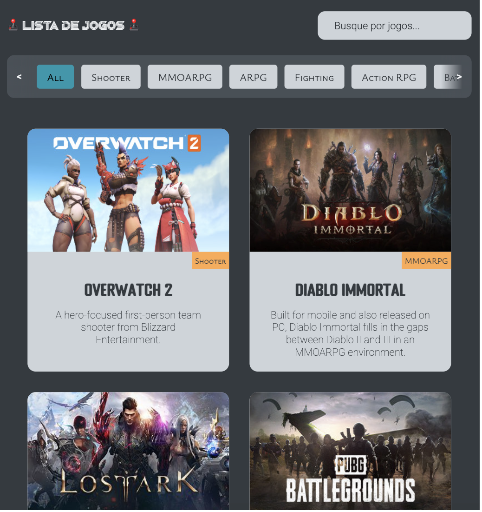
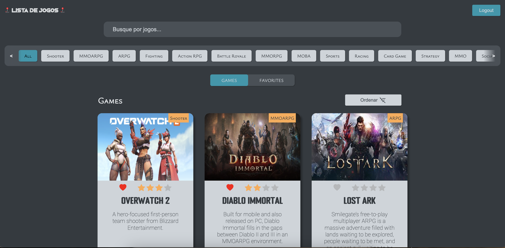

<h1>🕹️ Lista de Jogos 🕹️</h1>

Este é um projeto React desenvolvido como parte do desafio técnico para um cargo de Estágio.

Teste o site <a href="https://lista-de-jogos-rho.vercel.app" target="_blank">aqui</a>.

<h2>Imagens do projeto:</h2>

<h3>Versões mobile e tablet</h3>

<h2>Requisitos Funcionais:</h2>

<ul>
<li>O projeto deve ser feito usando React ou Next.JS ✅</li>
<li>Obter a lista de jogos em `/data` ✅</li>
<li>Apresentar um loader enquanto os dados são obtidos ✅</li>
<li>Apresentar os jogos em três colunas (no computador) ✅</li>
<li>Em cada card apresentar o título e imagem pelo ao menos ✅</li>
<li>Lidar com a responsividade, para que fique bem apresentado no computador, tablets ou celular ✅</li>
<li>Quando a API retornar o `status code` 500, 502, 503, 504, 507, 508 ou 509 apresentar ao usuário `O servidor fahou em responder, tente recarregar a página` ✅</li>
<li>Caso a API retorne outros erros, apresentar `O servidor não conseguirá responder por agora, tente voltar novamente mais tarde` ✅</li>
<li>Ao realizar uma chamada, não esperar mais que 5 segundos pelo retorno. Se os dados demorarem mais de 5 segundos para retornar apresentar `O servidor demorou para responder, tente mais tarde` ✅</li>
<li>Sempre que apresentar uma mensagem para o usuário, ou tiver os dados em mãos para apresentar, ocultar o loader ✅</li>
<li>Incluir um campo de busca, que permite localizar jogos pelo título, com busca case insensitive ✅</li>
<li>Uma vez que tenha os dados em mãos, veja quais `genre` foram retornados e permita ao usuário selecionar um deles, e então filtre para exibir apenas jogos do gênero selecionado ✅</li>
<li>Utilizar Firebase para realizar autenticação usando email/senha ✅</li>
<li>Ter um ❤️ para o usuário favoritar o jogo diretamente na lista, ficando vermelho quando marcado ✅</li>
<li>Salvar no firebase os jogos favoritos do usuário, no realtime ou firestore ✅</li>
<li>Ter um botão “Favoritos” que apresenta apenas jogos favoritados, permitindo ainda buscar e filtrar estes jogos. Pode ser na própria lista já apresentada ou em uma separada se preferir. ✅</li>
<li>Ao lado do coração, ter ★★★★ para o usuário avaliar o jogo, podendo marcar de uma em uma. Ou seja, ele pode escolher 1, 2, 3 ou as 4. ✅</li>
<li>Ter uma forma de ordenar por avaliação, vendo os melhores (ou piores) primeiro, clicando novamente para inverter a ordem. ✅</li>
<li>Ao carregar a interface, deixar o ❤️ vermelho para os itens favoritos e as ⭐️ amarelas nos itens avaliados ✅</li>
<li>Ao acessar sem estar autenticado, os ícones ❤️ e ★ deverão estar visíveis, mas ao clicar irá solicitar a autenticação ✅</li>
<li>Ao obter os jogos da API e os dados do firebase, apresentar. Manter o loading para os jogos. Não precisa de loading enquanto espera o firebase, até porque o firebase devolverá os dados mais rapidamente e pode ser complicado “esperar o firebase” se estiver “escutando o firebase”. ✅</li>
<li>A autenticação deve acontecer na rota `/auth/` do frontend, usando o provedor “E-mail/senha” do firebase, onde o usuário poderá criar uma conta ou acessar a conta já existente (se mantendo apenas nesta rota) ✅</li>
<li>Escolher um item para aplicar uma animação com CSS, pode ser ao favoritar, ou avaliar, ou quando os itens surgirem ✅</li>
<li>Publicar seu projeto online para testarmos (na mesma url de antes) ✅</li>
</ul>

<h3>Versão pc</h3>

<h3 >Como rodar esta aplicação no seu computador?</h3>

Obs.: Certifique-se de ter o Node.js instalado em seu sistema. 

1) Clone o repositório https://github.com/dieegomr/lista-de-jogos.git

2) Abra um terminal na pasta do projeto

3) No termina execute o comando `npm install` ou `yarn` para instalar as dependências necessárias

4) Após a instalação das dependências, execute o comando `npm run dev` ou `yarn dev` para iniciar o servidor de desenvolvimento.

4) Usar o link gerado no terminal para acessar a aplicação

